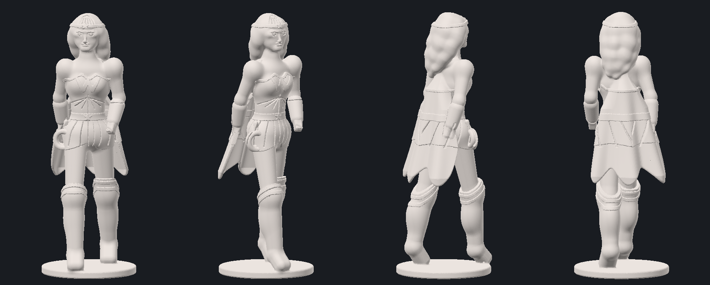

# Wonder Woman — процедурная 3D-модель для печати

Коллекционная фигурка героини в движении: шаг вперёд с опорой на правую ногу,
левая отталкивается, плечи развёрнуты против таза, волосы и накидка отброшены
ветром назад. Костюм — доспешный, по мотивам киноверсии.

Геометрия **полностью оригинальная** и построена кодом: тело собрано из
знаковых функций расстояния (SDF), которые сглаженно сплавляются друг с другом,
а костюм нанесён «декалями», облегающими готовую поверхность. Затем поле
переводится в полигоны алгоритмом marching cubes. Никакие чужие меши не
использовались.



## Файл для печати

| | |
|---|---|
| Файл | `wonder_woman.stl` (бинарный STL, единицы — мм) |
| Габариты | 53.9 × 54.3 × 150.0 мм |
| Треугольников | 742 192 (371 046 вершин) |
| Объём | 57.8 см³ — около 72 г в PLA, ~64 г в стандартной смоле |
| Топология | замкнутый водонепроницаемый меш, одна связная деталь, вырожденных граней нет |
| Ориентация | стоит на плоскости Z = 0, лицом к +Y |

## Что есть на модели

* **лицо** построено по классическим пропорциям головы (треть лба, треть носа,
  треть от носа до подбородка): череп + отдельная лицевая масса, скулы,
  надбровье, губы с объёмом, глазное яблоко в веках-раковинах с миндалевидным
  разрезом, брови и линия рта — поверхностные декали;
* тиара с пятиконечной звездой;
* доспешный корсет: вырез «сердечком», золотой кант по краю, расходящиеся
  от грудины панели, эмблема-«двойное W»;
* пояс со звездой, юбка из наборных пластин;
* наручи с продольными канавками;
* сапоги выше колена: наколенник, кант, манжета и рёбра по голени;
* лассо, свёрнутое кольцами на бедре;
* волосы — семь потоков-прядей, отброшенных назад и влево, с прочёсанными
  канавками по темени;
* короткая накидка, летящая назад (специально не достаёт до колен — длинный
  плащ полностью скрывает шаг);
* подставка Ø54 мм с проточкой по канту.

## Печать

* **Смола (SLA/DLP)** — рекомендуется: минимальные элементы (канавки век, брови,
  пряди) имеют глубину 0.25–0.6 мм и на смоле пропечатываются полностью.
* **FDM** — печатать соплом 0.2–0.4 мм, слой 0.1 мм. Мелкая мимика частично
  сгладится, силуэт и костюм читаются.
* Минимальная толщина стенки — ткань плаща: 1.95 мм вверху, 1.45 мм у края.
* Поддержки: под плащ, под подбородок и грудь, под кольцо лассо. Подставка
  печатается прямо на столе.
* Масштабирование: модель метрическая, 100 % = 150 мм. Ниже ~60 % мелкие
  канавки станут неразличимы.

## Как пересобрать

```bash
pip install numpy scikit-image trimesh fast_simplification pillow
python3 build_stl.py --voxel 0.3 --faces 420000 --out wonder_woman.stl
```

Полезные ключи:

| Ключ | Смысл |
|---|---|
| `--voxel` | шаг сетки в мм: меньше — детальнее и тяжелее (0.5 — черновик, 0.3 — финал) |
| `--faces` | целевое число треугольников после децимации (0 — без децимации) |
| `--height` | итоговая высота в мм |
| `--crop z0,z1` | собрать только слой по Z — быстрый просмотр головы и т. п. |
| `--min-part` | выбросить осколки мельче N мм³ |

Превью без графической подсистемы:

```bash
python3 render_preview.py wonder_woman.stl --out preview.png --views 0,40,120,180
```

## Устройство кода

| Файл | Назначение |
|---|---|
| `sdf_lib.py` | примитивы SDF, гладкие булевы операции, 2D-профили, механизм декалей |
| `head_lib.py` | голова в собственной системе координат: череп, лицо, глаза |
| `wonder_woman.py` | фигура: поза, анатомия, волосы, доспех, накидка, подставка |
| `face_preview.py` | быстрый рендер одной головы — цикл правки лица без сборки всей фигуры |
| `build_stl.py` | сэмплирование поля → marching cubes → чистка → STL |
| `render_preview.py` | клэй-рендер меша сплатами точек (numpy, без OpenGL) |

Два приёма, на которых держится качество:

1. **Декали.** Рельеф костюма — это пересечение призмы (или радиального конуса)
   профиля с телом, «раздутым» на высоту рельефа: `max(profile, body - h)`.
   Деталь ложится точно по поверхности, как наклейка.
   Все декали считаются от **замороженной** копии поля: рельеф даёт лишь
   приближённое расстояние, и если подавать его в следующую декаль, ошибка
   накапливается, пока детали не начинают висеть в воздухе.
2. **Проекция декалей.** На изогнутой поверхности призма декали вылезает
   «полками» там, где поверхность уходит вбок. Детали лица и костюма считаются
   в координатах длины дуги вокруг вертикальной оси (`cyl_proj`): вертикаль при
   этом остаётся точной — сферическая проекция смещала линию рта на 0.6 мм вниз,
   потому что реальный радиус поверхности не равен предполагаемому.
3. **Глаз.** Веки — сферическая оболочка вокруг глазного яблока, из которой
   вырезана миндалевидная апертура, *выдавленная вдоль взгляда*. Апертура из
   двух сфер (а не призма) — плоская линза, она не прорезает веко насквозь.
   Ось апертуры наклонена вниз на 11°: именно это даёт нависание верхнего века.
4. **Профиль лица считается, а не подбирается на глаз.** `prof`-замер печатает
   реальную координату поверхности в контрольных точках (лоб, надпереносье,
   кончик носа, губы, подбородок) и сравнивает с целевым профилем.
